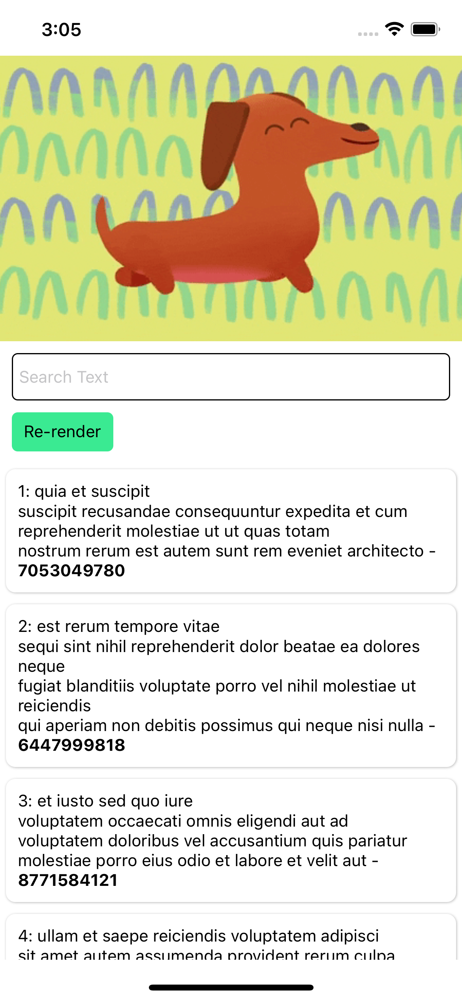
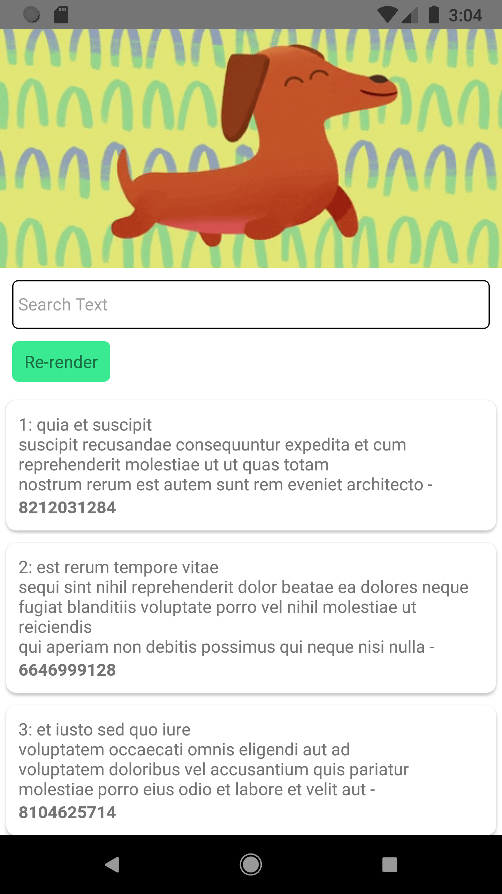
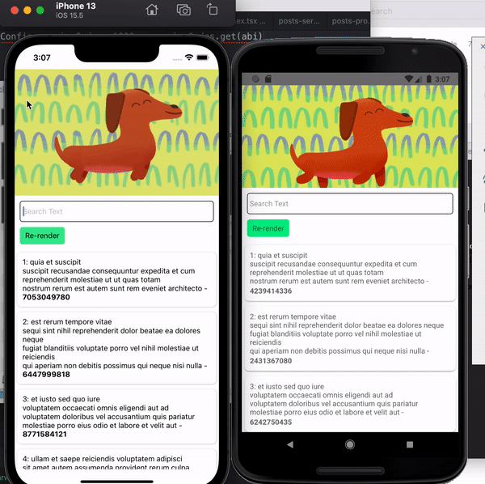

# Long list Posts App

## Installation

### How do I configure **iOS** app on my workstation?

- Clone project from Git
- Change directory to project

  ```
  $ cd ../project path
  $ yarn install
  ```

- IOS App
- Change directory to ios

  ```
  $ cd ios
  $ pod install
  ```

- Open `LongList.xcworkspace` file on ios folder `(project/ios/LongList.xcworkspace)`
- Run the project after indexing



### How do I configure **android** on my workstation?

- Clone project from Git
- Change directory to project
  ```
  $ cd ../project path
  $ yarn install
  $ yarn android
  ```
- Or Open Android studio
- Open android folder in project directory `(project/android)`
- Run the project after building




